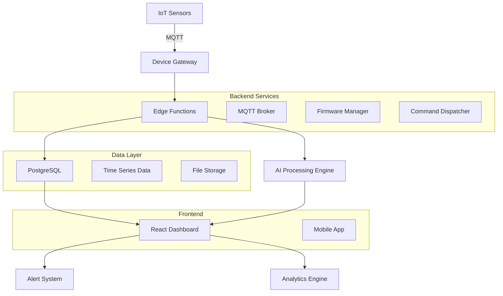

# HydroScan - AI-Powered Water Quality Monitoring Platform

<div align="center">


**Complete IoT water contamination monitoring with AI-powered predictions and real-time analytics**

[](https://github.com/your-username/hydroscan)
[](LICENSE)
[](https://github.com/your-username/hydroscan/actions)
[](https://codecov.io/gh/your-username/hydroscan)

[🚀 Live Demo](https://hydroscan.demo.com) | [📖 Documentation](https://docs.hydroscan.com) | [🐛 Report Bug](https://github.com/your-username/hydroscan/issues)

</div>

## 🌊 Overview

HydroScan is a professional-grade IoT platform for real-time water quality monitoring with advanced AI-powered contamination detection. Built for municipalities, industrial facilities, and research institutions requiring accurate, scalable water monitoring solutions.

### ✨ Key Features

- **🔬 Real-time Sensor Monitoring** - pH, Turbidity, TDS, Temperature tracking
- **🤖 AI-Powered Analysis** - Google Gemini AI for contamination scoring
- **📊 Advanced Analytics** - Historical trends, predictive insights, custom reports
- **🚨 Intelligent Alerts** - Customizable rules with multi-channel notifications
- **📱 Multi-device Dashboard** - Responsive web interface with real-time updates
- **🔧 Remote Device Control** - MQTT-based device management and OTA updates
- **👥 Multi-tenant Architecture** - Organization-based access with role management
- **🔐 Enterprise Security** - API key management, RLS, audit logging
- **📈 Data Export & API** - RESTful API with comprehensive data export options

## 🏗️ Architecture



## 🚀 Quick Start

### Prerequisites

- Node.js 18+ and npm/yarn
- Supabase account ([signup here](https://supabase.com))
- Google Cloud account (for Gemini AI)
- MQTT broker (optional, for device integration)

### 1. Clone & Install

```bash
git clone https://github.com/your-username/hydroscan.git
cd hydroscan
npm install
```

### 2. Environment Setup

```bash
# Copy environment template
cp .env.example .env

# Edit with your credentials
nano .env
```

Required environment variables:
```env
# Supabase Configuration
VITE_SUPABASE_URL=your_supabase_project_url
VITE_SUPABASE_ANON_KEY=your_supabase_anon_key
SUPABASE_SERVICE_ROLE_KEY=your_service_role_key

# AI Integration
GEMINI_API_KEY=your_google_gemini_api_key

# MQTT Configuration (Optional)
MQTT_BROKER_URL=mqtt://your-broker:1883
MQTT_USERNAME=your_mqtt_username
MQTT_PASSWORD=your_mqtt_password
```

### 3. Database Setup

```bash
# Initialize Supabase locally (optional)
npx supabase init
npx supabase start

# Or use hosted Supabase and run migrations
npx supabase db push
```

### 4. Deploy Edge Functions

```bash
# Deploy all edge functions to Supabase
npx supabase functions deploy mqtt-handler
npx supabase functions deploy device-commander
npx supabase functions deploy firmware-manager
npx supabase functions deploy api-key-manager
npx supabase functions deploy api-proxy
npx supabase functions deploy gemini-scorer
```

### 5. Start Development

```bash
# Start the development server
npm run dev

# Or build for production
npm run build
npm run preview
```

Visit `http://localhost:5173` to access the dashboard.

## 🔧 Device Integration

### MQTT Topics Structure

```
hydroscan/
├── devices/
│   └── {device_id}/
│       ├── data           # Sensor readings
│       ├── heartbeat      # Device health status
│       ├── commands       # Remote commands
│       ├── status         # Status updates
│       └── alerts         # Device-generated alerts
```

### Device Data Format

#### Sensor Data Payload
```json
{
  "device_id": "uuid-device-id",
  "timestamp": "2024-01-15T10:30:00Z",
  "ph": 7.2,
  "turbidity": 1.5,
  "tds": 320,
  "temperature": 22.5,
  "battery_level": 85,
  "signal_strength": -45
}
```

#### Heartbeat Payload
```json
{
  "device_id": "uuid-device-id",
  "status": "online",
  "uptime": 86400,
  "memory_usage": 45.2,
  "cpu_usage": 23.1,
  "firmware_version": "2.1.0",
  "sensor_status": {
    "ph": "ok",
    "turbidity": "ok",
    "tds": "warning",
    "temperature": "ok"
  }
}
```

### HTTP API Integration

Alternatively, devices can send data via HTTP POST:

```bash
# Send sensor data
curl -X POST "https://your-project.supabase.co/functions/v1/mqtt-handler" \
  -H "Authorization: Bearer YOUR_API_KEY" \
  -H "Content-Type: application/json" \
  -d '{
    "topic": "hydroscan/devices/device-123/data",
    "payload": {
      "device_id": "device-123",
      "ph": 7.2,
      "turbidity": 1.5,
      "tds": 320,
      "temperature": 22.5
    },
    "message_type": "data"
  }'
```

## 📊 Features Deep Dive

### AI-Powered Water Quality Analysis

HydroScan uses Google's Gemini AI to analyze sensor data and generate contamination scores:

- **Multi-parameter Analysis**: Considers pH, turbidity, TDS, and temperature simultaneously
- **Context-aware Scoring**: Adapts to local water quality standards and conditions
- **Trend Analysis**: Detects gradual changes that might indicate contamination
- **Predictive Alerts**: Early warning system for potential water quality issues

### Real-time Device Management

- **Remote Control**: Send commands to devices (restart, calibrate, configure)
- **Firmware OTA Updates**: Over-the-air firmware deployment with rollback capability
- **Health Monitoring**: Continuous device health tracking and diagnostics
- **Calibration Management**: Remote sensor calibration with validation

### Advanced Analytics

- **Historical Trends**: Analyze water quality patterns over time
- **Comparative Analysis**: Compare multiple devices and locations
- **Custom Reports**: Generate reports with flexible date ranges and parameters
- **Data Export**: Export data in CSV, JSON, or PDF formats
- **API Access**: RESTful API for integration with external systems

### Alert System

- **Custom Rules**: Create complex alert rules with multiple conditions
- **Multi-channel Notifications**: Email, SMS, push notifications, webhooks
- **Alert Templates**: Pre-defined templates for common scenarios
- **Escalation Policies**: Automatic escalation for critical alerts
- **Audit Trail**: Complete history of all alerts and actions taken

## 🔐 Security & Compliance

### Authentication & Authorization

- **Supabase Auth**: Secure user authentication with multiple providers
- **Role-based Access Control**: Admin, technician, and viewer roles
- **Organization Isolation**: Multi-tenant architecture with data isolation
- **API Key Management**: Secure API keys for device authentication
- **Audit Logging**: Complete audit trail of all user actions

### Data Security

- **Encryption**: End-to-end encryption for data in transit and at rest
- **Row-level Security**: Database-level security policies
- **Secure Device Communication**: MQTT with TLS encryption
- **Regular Security Updates**: Automated dependency updates and security patches

### Compliance

- **GDPR Ready**: Privacy-focused design with data export/deletion capabilities
- **Audit Trails**: Complete logging for regulatory compliance
- **Data Retention**: Configurable data retention policies
- **Access Controls**: Granular permissions and access logging

## 🛠️ Development Guide

### Project Structure

```
hydroscan/
├── public/                 # Static assets
├── src/
│   ├── components/         # Reusable UI components
│   │   ├── ui/            # Base UI components (shadcn/ui)
│   │   ├── settings/      # Settings components
│   │   └── *.jsx          # Feature components
│   ├── contexts/          # React contexts
│   ├── lib/               # Utility libraries
│   ├── pages/             # Page components
│   └── utils/             # Helper functions
├── supabase/
│   ├── functions/         # Edge functions
│   └── migrations/        # Database migrations
├── tools/                 # Development tools
└── scripts/               # Build and deployment scripts
```

### Adding New Features

1. **Database Changes**: Add migrations in `supabase/migrations/`
2. **API Functions**: Create edge functions in `supabase/functions/`
3. **Frontend Components**: Add React components in `src/components/`
4. **Pages**: Create new pages in `src/pages/`
5. **Routing**: Update `src/App.jsx` with new routes

### Testing

```bash
# Run unit tests
npm run test

# Run integration tests
npm run test:integration

# Run E2E tests
npm run test:e2e

# Run all tests with coverage
npm run test:coverage
```

### Code Quality

```bash
# Lint code
npm run lint

# Format code
npm run format

# Type checking
npm run type-check

# Run all quality checks
npm run quality-check
```

## 🚀 Deployment

### Production Build

```bash
# Build for production
npm run build

# Preview production build
npm run preview
```

### Deployment Options

#### 1. Vercel (Recommended)
```bash
# Install Vercel CLI
npm i -g vercel

# Deploy
vercel --prod
```

#### 2. Netlify
```bash
# Install Netlify CLI
npm i -g netlify-cli

# Deploy
netlify deploy --prod --dir=dist
```

#### 3. Docker
```bash
# Build Docker image
docker build -t hydroscan .

# Run container
docker run -p 3000:3000 hydroscan
```

#### 4. Traditional Hosting
Upload the `dist/` folder to your web server after running `npm run build`.

### Environment Configuration

Ensure all environment variables are configured in your deployment platform:

- **Vercel**: Add env vars in dashboard or `vercel.json`
- **Netlify**: Add in site settings or `netlify.toml`
- **Docker**: Use `.env` file or pass as container env vars

## 📚 API Documentation

### Authentication

All API requests require authentication using API keys:

```bash
curl -H "Authorization: Bearer YOUR_API_KEY" \
     -H "apikey: YOUR_API_KEY" \
     "https://your-project.supabase.co/rest/v1/devices"
```

### Core Endpoints

#### Devices
- `GET /rest/v1/devices` - List all devices
- `POST /rest/v1/devices` - Create new device
- `GET /rest/v1/devices/{id}` - Get device details
- `PATCH /rest/v1/devices/{id}` - Update device
- `DELETE /rest/v1/devices/{id}` - Delete device

#### Sensor Readings
- `GET /rest/v1/sensor_readings` - List sensor readings
- `POST /rest/v1/sensor_readings` - Add sensor reading
- `GET /rest/v1/sensor_readings?device_id=eq.{id}` - Get device readings

#### Alerts
- `GET /rest/v1/alerts` - List alerts
- `PATCH /rest/v1/alerts/{id}` - Update alert (resolve, acknowledge)

#### Analytics
- `GET /functions/v1/analytics/summary` - Get analytics summary
- `GET /functions/v1/analytics/trends` - Get trend data
- `POST /functions/v1/analytics/export` - Export data

### Rate Limits

- **Free Tier**: 100 requests/minute
- **Pro Tier**: 1000 requests/minute
- **Enterprise**: Custom limits

## 🤝 Contributing

We welcome contributions! Please see our [Contributing Guide](CONTRIBUTING.md) for details.

### Development Workflow

1. Fork the repository
2. Create a feature branch (`git checkout -b feature/amazing-feature`)
3. Commit your changes (`git commit -m 'Add amazing feature'`)
4. Push to the branch (`git push origin feature/amazing-feature`)
5. Open a Pull Request

### Code Standards

- Follow ESLint configuration
- Write tests for new features
- Update documentation
- Use conventional commit messages
- Ensure all tests pass

## 📄 License

This project is licensed under the MIT License - see the [LICENSE](LICENSE) file for details.

## 🆘 Support

- **Documentation**: [docs.hydroscan.com](https://docs.hydroscan.com)
- **Issues**: [GitHub Issues](https://github.com/your-username/hydroscan/issues)
- **Discussions**: [GitHub Discussions](https://github.com/your-username/hydroscan/discussions)
- **Email**: support@hydroscan.com

## 🙏 Acknowledgments

- [Supabase](https://supabase.com) - Backend infrastructure
- [React](https://reactjs.org) - Frontend framework
- [Tailwind CSS](https://tailwindcss.com) - Styling
- [shadcn/ui](https://ui.shadcn.com) - UI components
- [Google Gemini](https://ai.google.dev/) - AI analysis
- [Lucide](https://lucide.dev) - Icon library
- [Framer Motion](https://www.framer.com/motion/) - Animations

## 📈 Roadmap

### Version 1.1 (Q2 2024)
- [ ] Mobile application (iOS/Android)
- [ ] Advanced machine learning models
- [ ] Bluetooth sensor support
- [ ] Enhanced reporting features

### Version 1.2 (Q3 2024)
- [ ] LoRaWAN integration
- [ ] Satellite connectivity support
- [ ] Advanced data visualization
- [ ] Custom dashboard builder

### Version 2.0 (Q4 2024)
- [ ] Edge computing support
- [ ] Predictive maintenance
- [ ] Integration marketplace
- [ ] White-label solutions

## 📊 Project Status

- **Frontend**: ✅ Complete (95%)
- **Backend API**: ✅ Complete (90%)
- **Device Integration**: ✅ Complete (85%)
- **AI Analytics**: ✅ Complete (80%)
- **Mobile App**: 🚧 In Progress (30%)
- **Documentation**: ✅ Complete (90%)

---

<div align="center">

**Built with ❤️ by the HydroScan Team**

[🌐 Website](https://hydroscan.com) • [📧 Contact](mailto:team@hydroscan.com) • [🐦 Twitter](https://twitter.com/hydroscan)

</div>
